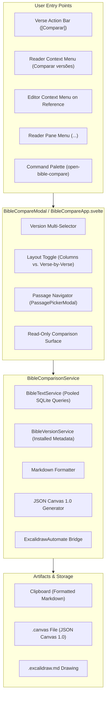

# Bible Text Comparison & Visual Canvas Export

The **Bible Text Comparison** feature in OpenBible enables multi-version comparative study of Scripture directly within Obsidian. Users can view passages side-by-side across all installed Bible translations, copy structured comparisons as Markdown, and export visual diagrammatic boards to both **Obsidian Canvas** (`.canvas`) and **Excalidraw**.

---

## 1. Architectural Overview

### Components

- **`BibleComparisonService` (`src/services/BibleComparisonService.ts`)**:
  - Core orchestrator for comparative Scripture queries.
  - Interrogates `BibleTextService.readChapter` across arbitrary SQLite versions without reloading database binaries.
  - Builds structured `PassageComparisonData` models with version metadata and verse-by-verse alignment rows.
  - Generates valid [JSON Canvas 1.0](https://jsoncanvas.org/spec/1.0/) specifications.
  - Interfaces with the `ExcalidrawAutomate` API using bound text containers (`box: "box"`).
- **`BibleCompareModal` (`src/ui/modals/BibleCompareModal.ts`)**:
  - Obsidian Modal container configured with responsive dimensions (`90vw`, max `1100px`) and mobile drawer adaptation.
- **`BibleCompareView` (`src/BibleCompareView.ts`)**:
  - Dedicated workspace `ItemView` (`open-bible-compare-view`) allowing persistent tabs or side-by-side split panes for ongoing multi-version study.
- **`BibleCompareApp` (`src/ui/modals/BibleCompareApp.svelte`)**:
  - Svelte 5 interactive application handling real-time version toggling, HTML5 drag-and-drop column reordering, layout switching, reference changing, and export operations. Can run inside both the modal and workspace leaves.

---

## 2. Comparison Modes & User Experience

### A. Passage Grouping & View Layouts

When comparing passages containing multiple verses (such as John 14:2-3), OpenBible groups verses into continuous, natural textual flow within each version container. Verses are not artificially fragmented into isolated verse boxes; instead, the separation exists purely across the compared Bible versions (one card per translation).

The comparison surface supports two complementary layouts:

1. **Columns by Version (`columns`)**:
   - Displays each selected translation in an independent vertical card arranged side-by-side in a horizontally scrollable grid.
   - Each card features a drag handle (`grip-vertical`), version abbreviation badge, full translation title, copy button, remove action, and running verses formatted with superscript numbers.
   - Users can **drag and drop** column cards or version chips to rearrange translations in any custom order.
   - Ideal for reading larger continuous sections side-by-side across translations.

2. **List by Version (`verses` / stacked list mode)**:
   - Displays each selected translation in a full-width stacked card layout.
   - All verses for that translation flow together as a unified biblical passage.
   - Ideal for mobile devices, narrower workspace split panes, or in-depth study of long paragraphs.

### B. Drag-and-Drop Version Reordering

Users can reorder Bible translations using intuitive drag-and-drop interactions:
- **In Cards View**: Grab any version card by its header grip handle and drop it over another card to swap positions.
- **In the Version Selection Bar**: Active version chips feature drag handles and can be dragged directly within the chip strip to reorder translations.
- Custom order is preserved during the session and synchronized across layout switches.

### C. Workspace View (Dedicated Tab & Split Pane)

In addition to the quick modal popup, comparisons can be opened directly as full workspace leaves:
- Click the **Open in tab** (`panel-top`) button on the top right of the modal to convert the current comparison into a persistent workspace tab.
- Use the commands **`OpenBible: Open comparison in new tab`** or **`OpenBible: Split editor with version comparison`** from the command palette.
- Workspace leaves persist their active passage, reference title in the tab header, and layout mode.

### D. Clean Toolbar & Context Menu Actions

The comparison toolbar maximizes vertical reading space by presenting controls in a single streamlined row:
- **Left**: Clickable Scripture reference pill (`[📖 Romanos 9:3-5 ▾]`) that opens the passage picker modal on click.
- **Right**:
  - **Copy Comparison** (`[📋 Copiar comparação]`): Formats and copies the complete multi-version comparison as a unified single text block without blockquote symbols (`>`) or blank lines, preventing fragmentation when pasted into Excalidraw. Responsive styling collapses the text label on narrow panes.
  - **Layout Switcher Tabs**: Segmented toggle with icon-only buttons (`[ ⊞ | ☰ ]`) with accessible tooltips (`aria-label`) to toggle between column-based and stacked list comparative views.
  - **More Options (`...`) Context Menu**: Native Obsidian popup `Menu` providing:
    - **Copiar para Excalidraw (bloco único)**: Direct clipboard copy optimized for Excalidraw without `>` or empty lines.
    - **Copiar comparação em Markdown**: Full markdown export with section headings.
    - **Exportar para o Canvas**: Generates `.canvas` file.
    - **Exportar para o Excalidraw**: Automates drawing creation via ExcalidrawAutomate.

### E. Excalidraw Single-Block Clipboard Optimization & Per-Version Copy

Pastings into Excalidraw frequently created fragmented, multiple detached text boxes due to Markdown blockquote symbols (`>`) and blank lines (`\n\n`). OpenBible optimizes clipboard export:
- **Unified Single Block for Excalidraw with Verse Line Breaks**: Scripture comparisons copied to the clipboard avoid empty lines (`\n\n`) and omit `>` prefixes, ensuring Obsidian Excalidraw generates exactly one unified text element. Within this single element, each verse cleanly breaks into its own line (`\n`) for optimal legibility (e.g. verse 2 on line 1, verse 3 on line 2, and the reference on the following line).
- **Individual Version Copy**: Every translation card in both columns and list layouts provides a dedicated header copy button (`[📋]`), enabling users to copy that single version's complete passage without `>` prefixes, breaking each verse onto a new line and concluding with the reference.

### F. Typography, Theming & Visual Polish

- **Obsidian Theme Harmony**: Verse text strictly adopts Obsidian's reading font (`var(--font-text, var(--font-text-theme, var(--font-interface))`), text size (`var(--font-text-size, 1rem)`), and line spacing (`var(--line-height-normal, 1.75)`).
- **Sticky Column Headers**: In Columns mode, version cards feature sticky headers with backdrop blur (`backdrop-filter: blur(8px)`) so version badges, titles, and actions stay visible during deep chapter scrolling.
- **Continuous Verse Flow**: Verses within a card flow naturally with superscript numerals (`² ... ³ ...`), making multi-verse reading seamless.
- **Omitted Verse Handling**: Translations omitting certain textual variants render a polite, muted label (`— (Versículo ausente nesta versão)` / `— (Verse absent in this version)`) instead of empty whitespace.
- **Direct Card Removal**: Version cards feature a quick `[x]` remove button to unselect a translation without navigating back to the top chip strip.
- **Accessibility & Interaction**: Full keyboard focus visibility (`:focus-visible`), aria labels, localized tooltips in English and Portuguese, and smooth micro-interactions for dragging.

---

## 3. Obsidian Canvas Integration (JSON Canvas 1.0)

OpenBible implements native canvas generation conforming strictly to the open [JSON Canvas 1.0 Specification](https://jsoncanvas.org/spec/1.0/).

### Specification Compliance

- **Node Identifiers**: 16-character hexadecimal lowercase strings (`/^[0-9a-f]{16}$/`) generated using cryptographic randomness.
- **Node Structure**:
  - **Reference Header Node**: Central top banner node containing the passage title, summary, and translation tags (color preset `"4"` / Green).
  - **Version Card Nodes**: Structured text nodes placed beneath the header at `y = 220` with non-overlapping `x` positions (`width = 380`, `gap = 40`).
  - **Card Content**: Formatted Markdown with translation header and bolded verse numbers.
  - **Preset Colors**: Automatic cyclical assignment of JSON Canvas color presets (`"1"` Red, `"2"` Orange, `"3"` Yellow, `"5"` Cyan, `"6"` Purple).
- **Edge Connections**:
  - Directed edges connecting the bottom of the Reference Header node (`fromSide: "bottom"`) to the top of each Version Card node (`toSide: "top"`, `toEnd: "arrow"`).
- **Vault Persistence**:
  - Files are automatically saved to `OpenBible/comparisons/{Book} {Chapter}_{Verses} - Comparacao.canvas` (or the user-configured export folder).
  - Existing files with the same name are automatically disambiguated with incremental counters (`(1)`, `(2)`).
  - The canvas file is immediately opened in an active Obsidian tab for direct visual manipulation.

---

## 4. Excalidraw Integration

When the community plugin [`obsidian-excalidraw-plugin`](https://github.com/zsviczian/obsidian-excalidraw-plugin) is installed and enabled in the vault, OpenBible integrates directly with its official automation engine (`ExcalidrawAutomate`):

- **Workbench Lifecycle**: Initializes and clears the workbench using `ea.reset()`.
- **Bound Text Containers (`box: "box"`)**:
  - Instead of unconstrained floating text over fixed-dimension boxes, OpenBible creates bound text containers via `ea.addText(x, y, text, { box: "box", width: 380, textAlign: "left" })`.
  - Excalidraw measures text content dynamically, wraps lines cleanly, auto-sizes container height to prevent any text clipping or overflow, and locks the container to the text.
- **Header & Connectors**:
  - Reference title card is placed centered at the top.
  - Multi-version cards are laid out side-by-side with distinct pastel background fills.
  - Connector arrows are bound between objects via `ea.connectObjects(headerId, "bottom", cardId, "top", { numberOfPoints: 2 })`.
- **Export & Opening**:
  - Calls `ea.create({ filename, foldername, onNewPane: true })`.
  - Automatically handles drawing persistence and displays the drawing in a new pane.
- **Graceful Degradation**:
  - If `obsidian-excalidraw-plugin` is not installed or enabled, OpenBible displays a helpful Notice alerting the user without crashing or blocking.

---

## 5. Settings & Persistence

The following configuration options are integrated into `OpenBibleSettings`:

| Setting | Type | Default | Description |
|---|---|---|---|
| `compareSelectedVersions` | `string[]` | `[]` | Remembers the user's selected translation paths across comparison sessions. |
| `compareExportFolder` | `string` | `"OpenBible/comparisons"` | Destination folder in the vault for `.canvas` and `.excalidraw.md` files. |
| `comparePreferredLayout` | `"columns" \| "verses"` | `"columns"` | Preferred default layout in the comparison modal. |

---

## 6. User Entry Points

1. **Verse Action Bar**: Floating toolbar shows the `[Comparar]` action whenever one or more verses are selected in the reader.
2. **Reader Context Menu**: Right-clicking selected verses provides `Comparar versões`.
3. **Editor Context Menu**: Right-clicking a detected scripture reference in any Markdown note provides `Comparar versões`.
4. **Reader Tab Menu (`...`)**: Option in the tab header options menu to compare the currently displayed passage.
5. **Modal "Open in Tab" Button**: Header icon button to pop the modal out into a dedicated workspace tab.
6. **Command Palette**:
   - `OpenBible: Compare Bible verses` (`open-bible-compare`): Opens modal comparison with passage navigation.
   - `OpenBible: Open comparison in new tab` (`open-bible-compare-tab`): Opens comparison in a dedicated workspace tab.
   - `OpenBible: Split editor with version comparison` (`open-bible-compare-split`): Opens comparison alongside active editor pane.
